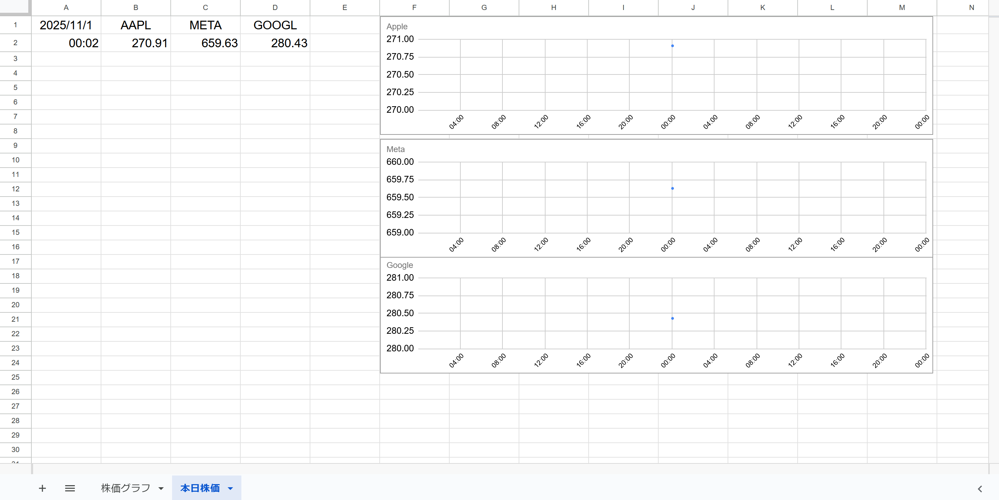
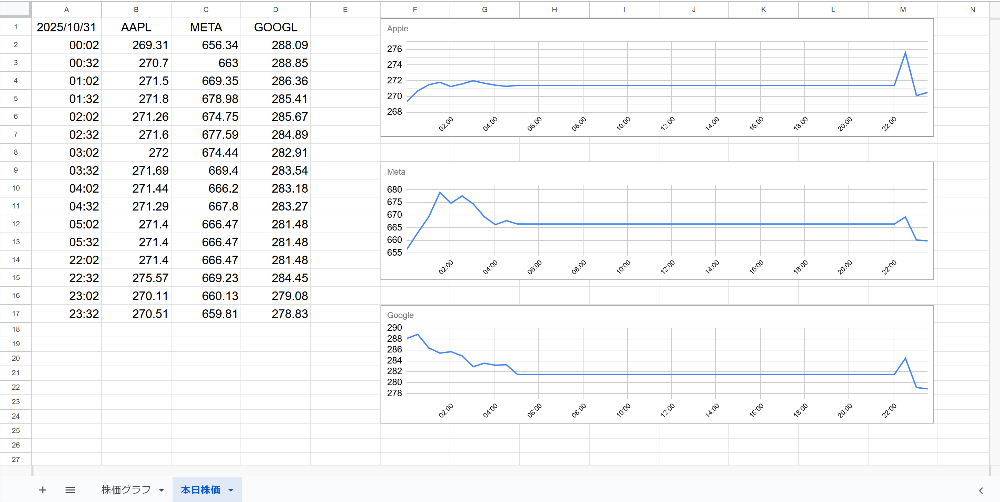
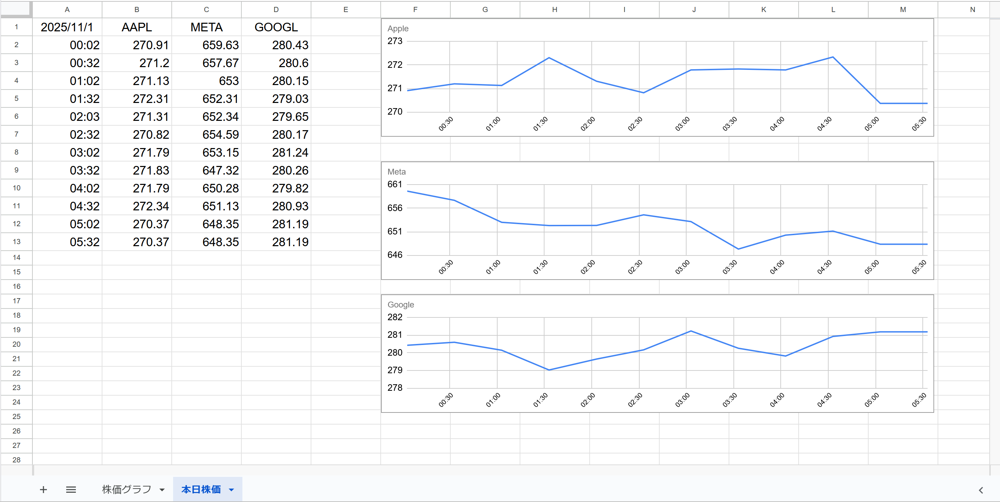
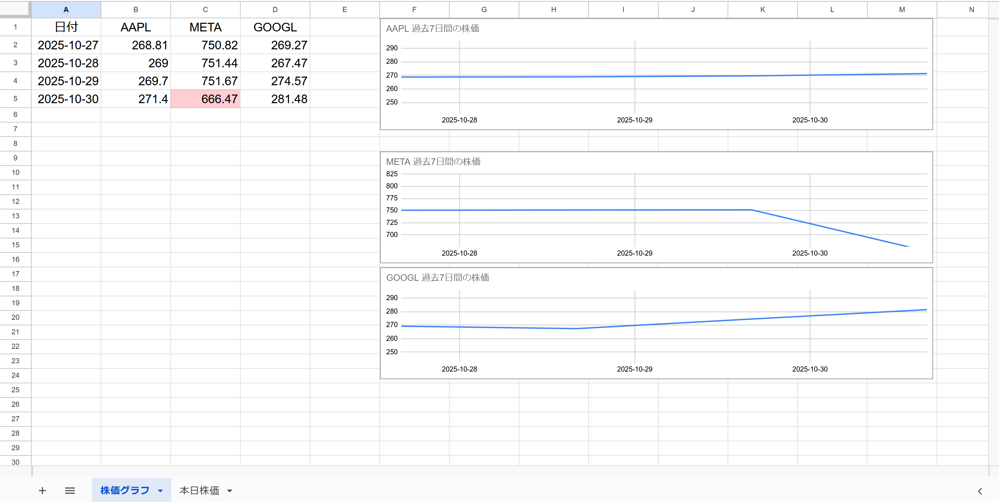

## 📈 株価管理ツール（Google スプレッドシート × Apps Script）

Google Apps Script と Google スプレッドシートを活用した、米国株価の自動取得・可視化ツールです。 ユーザーの手を煩わせることなく、リアルタイム株価の取得・変動率の色分け・日別＆週別のグラフ生成を自動で行います。

---

## 目的

この株価管理ツールは、Google スプレッドシートとApps Scriptを活用して、米国株価の取得・可視化・記録を完全自動化するツールです。

毎日の株価チェックや記録作業を自動化し、視覚的にわかりやすいグラフで変動を把握できるように設計しました。 投資初心者から日々の株価管理を効率化したい方まで、誰でも簡単に使えることを目指しています。

---

## 🛠 主な機能

✅ 米国市場の取引時間に合わせた自動取得（22:30〜5:00）

✅ AAPL / META / GOOGL の株価を定期取得

✅ 5%、10%の変動に応じたセルの色分け

✅ 取得失敗時のエラーハンドリング（グレー表示）

✅ 日別の株価推移グラフを自動生成

✅ 過去7日間の株価をまとめた週次グラフも自動生成

✅ 日付が変わると「本日株価」シートをリセットして新規記録

✅ 全シートに日付を自動挿入

✅ 視認性を高めるスタイル統一（フォントサイズ・行高・中央揃え）

---

## 🧭システムの流れ

このツールを使うと、スプレッドシート上で株価データが自動で蓄積・可視化され、基本的に以下の写真のような感じになります：

Apple・Meta・Googleの株価が時間ごとに記録され、右側に折れ線グラフとして表示されます。1日分の動きが一目で把握できます。

### 🗂 本日株価シート

このツールは、まず1点から始まります。時間ごとの株価を記録し、1日分の動きを一覧で確認できます。

初回実行時は1データのみですが、以降自動で下に蓄積されていきます

### 📈 日別グラフ

取得された株価をもとに、リアルタイムでグラフが生成されます。

初回は1データのみですが、数時間でここまで蓄積され、グラフも動き出します。

Metaの急落やGoogleの微増など、変動が視覚化されます。

### 📊 週次グラフ（データ一覧）

各日の終値をまとめて表示

日々の変動を確認でき、投資判断や報告資料にも活用可能です

---

## 🚀 使い方

Google スプレッドシートを作成

Apps Script エディタを開き、本リポジトリのコードを貼り付け

fetchDailyStockPrices() をトリガーに設定（例：15分ごと）

トリガー設定後、次の区切り時間（例：23:00）まで待つと自動で動き出します！

        
### (注意)

初回実行時、Googleから「このアプリは確認されていません」という警告が表示されることがあります。その場合は以下の手順でスクリプトの実行を許可してください：

①「詳細」をクリック

➁「（プロジェクト名）に移動」を選択

③自分のGoogleアカウントを選択

④アクセス権限を確認し、「許可」をクリック　で実行し直せばOK

※これは、GASプロジェクトがGoogleにより公開確認されていないために表示される標準の警告です。

---

## 💡 工夫したポイント

市場時間の制御：米国市場の開場時間（22時台〜5時台）に限定してAPI呼び出しを最適化

視覚的な工夫：変動率に応じた色分けで、株価の動きを直感的に把握可能

エラー耐性：取得失敗時も処理が止まらず、視覚的に識別できる

グラフの見やすさ：横長＆余白調整で、推移が一目でわかるように設計

データの重複防止：同じ日付・時間帯のデータを上書きしないように工夫

再利用性の高いコード構造：銘柄追加や期間変更も容易

---    

## 🧩 今後の改善点

2週間・1ヶ月のグラフ生成機能の追加

「本日株価」→「株価グラフ」の順にシート表示を整理

1週間のグラフを1日1回のトリガー実行のみで作成させる

市場時間0:00〜0:30の取得で前日分が上書きされる問題と、取引時間（〜5:00）を過ぎて2回分カウントされる問題の解消

市場開場前（22:00〜22:29）の取得を制御し、誤データや誤差のあるグラフ生成を防ぐ

ユーザーが任意の米国株銘柄を入力した際に、1日・1週間の株価推移グラフを自動生成する機能の追加

グラフ線が+-10%以上の株価変化でグラフから外れていたので、対応させたい

---

## 🔧 技術スタック

Google Apps Script（GAS）

Google スプレッドシート

GOOGLEFINANCE 関数

JavaScript（ES5ベース）

---

## 📌 注意点

GOOGLEFINANCE 関数は一時的に取得失敗することがあります。再取得で回復する場合が多いです。

トリガー設定後、すぐには動かないことがあります。次の実行タイミングまでお待ちください。
