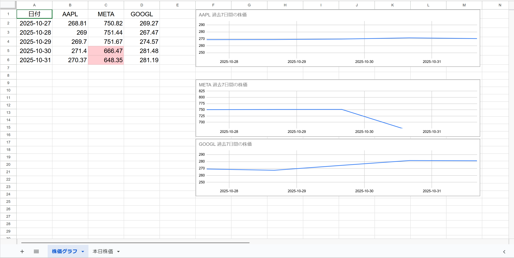

## 📈 株価管理ツール（Google スプレッドシート × Apps Script）

Google Apps Script と Google スプレッドシートを活用した、米国株価の自動取得・可視化ツールです。 ユーザーの手を煩わせることなく、リアルタイム株価の取得・変動率の色分け・日別＆週別のグラフ生成を自動で行います。

投資初心者や、日々の株価管理を効率化したい個人投資家向けとなっています。

---

## システム概要

Google スプレッドシート × Apps Script による、米国株価の自動取得・可視化ツールとなっています。

AAPL / META / GOOGL の株価を30分ごとに記録し、日次・週次グラフを自動生成します。

現在、このスプレッドシートで、ツールの動きを試しています。 

https://docs.google.com/spreadsheets/d/1EK1zL5p-PEuFRml_fOhKIDMu2qOFJ0JgYKYVibOOoa8/edit?gid=793241765#gid=793241765

---

### 🛠 使用技術

Google Apps Script（GAS） 　スプレッドシート操作・トリガー設定・グラフ生成などの自動化処理を実装

Google スプレッドシート 　株価データの蓄積・可視化・ユーザー操作のインターフェースとして活用

GOOGLEFINANCE 関数 　米国株のリアルタイム価格取得に使用（AAPL / META / GOOGL）

JavaScript（ES5ベース） 　GAS内でのロジック構築・条件分岐・エラー処理に活用

SpreadsheetApp.ChartBuilder API 　日別・週次の株価推移グラフを自動生成

---

## 🛠 主な機能

✅ 米国市場の取引時間に合わせて、22時台〜5時台の株価を自動取得するように設計されています。

✅ AAPL / META / GOOGL の株価を定期取得（※主要テック銘柄を例として設定）

✅ 5%、10%の変動に応じたセルの色分け

✅ 取得失敗時のエラーハンドリング（グレー表示）

✅ 日別の株価推移グラフ・過去7日間の株価をまとめた週次グラフの自動生成

✅ 日付が変わると「本日株価」シートをリセットして新規記録

✅ 全シートに日付を自動挿入

✅ 視認性を高めるスタイル統一（フォントサイズ・行高・中央揃え）

---

### 🧭 システムの流れ

このツールでは、Google スプレッドシート上で株価データが自動的に蓄積・可視化されます。
Apple、Meta、Google の株価が時間ごとに記録され、右側には各銘柄の株価推移が折れ線グラフとして表示されます。

📈 StockSheetSync – 自動株価記録・可視化ツール

StockSheetSync は、Google スプレッドシート上で
米国主要3銘柄（Apple・Meta・Google）の株価データを自動取得・可視化するシステムです。

トリガーを設定することで、以下の2種類の処理が自動で実行されます。

🕒 日次処理（createDailyChart） – 1日単位の株価推移を記録・可視化

📆 週次処理（createSummaryCharts） – 過去7日間の株価データを集計・グラフ化

---

### ⚙️ 日次処理（30分ごとトリガー）

トリガーを 30分ごと に設定すると、
米国市場の取引時間（日本時間 22時〜翌5時）に以下の処理が自動実行されます。

1️⃣ 株価データの取得と記録

Apple（AAPL）、Meta（META）、Google（GOOGL）の株価を取得し、
取得時刻とともに「本日株価」シートへ追記。

これにより、1日の値動きが30分単位で記録されます。

2️⃣ 一時シート tempData の生成と削除

各実行時に、データ格納用の tempData シートが自動生成。

全銘柄の処理が完了すると、自動的に削除されます。

3️⃣ 日次グラフの作成（createDailyChart）

「本日株価」シートのデータから、
各銘柄（Apple・Meta・Google）の折れ線グラフを生成。

1日の値動きを時系列で視覚的に確認できます。

4️⃣ 書式調整

時刻列（A列）は「hh:mm」形式に統一。

行の高さ・フォントサイズを自動調整し、見やすさを向上。

💡 処理後、「本日株価」シートでは1日分の株価推移がグラフ付きで確認できます。
また下に示す日次グラフの部分て詳しく説明しています。

### 📆 週次処理（1日1回実行）

1日1回のトリガー設定により、過去7日間の株価推移を自動でまとめます。

1️⃣ 7日間のデータ取得

各銘柄（AAPL・META・GOOGL）の7日間の株価データを
GOOGLEFINANCE 関数で取得。

一時的に tempData シートに展開。

2️⃣ グラフ用シートの作成（株価グラフ）

既存の週次グラフがある場合は上書き。

「株価グラフ」シートに3銘柄の7日間の株価推移を折れ線グラフで描画。

値上がり・値下がり率に応じてセル背景色を自動調整。

3️⃣ 一時シート削除

処理完了後、tempData シートは自動削除されます。

これらによって、1日分の動きがひと目で把握できるようになっており、基本的には下に示す週次グラフのような画面になります：

### 📄 処理後に残るシート

シート名　　　　　内容

本日株価　　　　　30分ごとの株価データを時系列で記録

株価グラフ　　　　当日・週次の株価推移を折れ線グラフで可視化

### 🧩 処理中のみ存在するシート
シート名　　　　　役割
tempData　　　　データ取得・処理時のみ一時的に生成され、完了後に自動削除

### 🗂 本日株価シート

このツールは、まず1点から始まります。時間ごとの株価を記録し、1日分の動きを一覧で確認できます。

初回実行時は1データのみですが、以降自動で下に蓄積されていきます。

### 📈 日別グラフ

取得された株価をもとに、リアルタイムでグラフが生成されます。

数時間でここまでデータが蓄積され、グラフも動き出します。

Metaの急落やGoogleの微増など、変動が視覚化されます。

### 📊 週次グラフ（データ一覧）

各日の終値をまとめて表示

日々の変動を確認でき、投資判断や報告資料にも活用可能です 

この例では、Metaの終値が10%以上下落しているため、C5セルが赤く表示され、変動の大きさが一目でわかります。

ただ、現在のグラフ設定では、急激な株価変動に対応しきれず、表示が一部切れてしまっています。

※以下のデータは22時以降に自動で追加されます。この例では、Metaの前日比10%以上の下落によりC6セルが赤色で強調表示されています。
こちらでも、急激な株価変動に対応しきれず、表示が一部切れてしまっています。

---

## 🚀 使い方

Google スプレッドシートを作成

Apps Script エディタを開き、本リポジトリのコードを貼り付け

fetchDailyStockPrices() をトリガーに設定（例：15分ごと）

トリガー設定後、次の区切り時間（例：23:00）まで待つと自動で動き出します！

        
### (注意)

初回実行時、Googleから「このアプリは確認されていません」という警告が表示されることがあります。その場合は以下の手順でスクリプトの実行を許可してください：

①「詳細」をクリック

➁「（プロジェクト名）に移動」を選択

③自分のGoogleアカウントを選択

④アクセス権限を確認し、「許可」をクリック　で実行し直せばOK

※これは、GASプロジェクトがGoogleにより公開確認されていないために表示される標準の警告です。

---

### ✨ 設計上の工夫

市場時間の制御 　米国市場の開場時間（22:30〜5:00）に合わせて取得タイミングを最適化

視覚的な工夫 　±5%、±10%の変動に応じたセルの色分けで、株価の動きを直感的に把握可能

エラー耐性 　取得失敗時も処理が止まらず、グレー表示で視覚的に識別可能

グラフの見やすさ 　横長＆余白調整で、推移が一目でわかるように設計

データの重複防止 　同じ日付・時間帯のデータを上書きしないように工夫

再利用性の高いコード構造 　銘柄追加や期間変更も容易に対応可能

---    

## 📌 注意点

GOOGLEFINANCE 関数は一時的に取得失敗することがあります。再取得で回復する場合が多いです。

トリガー設定後、すぐには動かないことがあります。次の実行タイミングまでお待ちください。

---

## 📂 ファイル構成と役割

ファイル / シート名　　　役割

本日株価 シート　　　　　当日の株価を時間ごとに記録するメインシート

株価グラフ シート　　　　Apple / Meta / Google の株価推移を折れ線グラフで週間で表示

gsファイル(関数)　　　　 株価取得・記録・グラフ生成などのロジックを記述

トリガー設定　　　　　　 30分間隔の自動実行や日付切り替え処理を制御。22時台〜5時台の取得に対応
 
---

## 📄 .gs ファイルについての簡潔な書き方例

複数の .gs ファイルに処理を分割しており、以下のような役割で構成されています：

株価の取得・記録

グラフの生成

トリガーの設定と制御

データの整形・色分け

※ファイル名は機能ごとに分けており、必要に応じて拡張・修正しやすい構造になっています。

---

## 🧩 今後の改善点

### 📈 グラフ機能の強化

2週間・1ヶ月のグラフ生成機能を追加する

1週間のグラフを、1日1回のトリガー実行のみで作成できるようにする

グラフ線が ±10%以上の変化で表示範囲から外れる問題に対応する

（文章直す）グラフの緩い変化で変化が分かりづらいことと、急騰・急落でグラフが切れてしまうことへの自動対応

### 🗂 シート構成の整理

「本日株価」→「株価グラフ」の順にシート表示を並べ替える

### ⏱️ 取得タイミングの調整

0:00〜0:30の取得で前日分が上書きされる問題を解消する

取引時間（〜5:00）を過ぎて2回分カウントされる問題を修正する

市場開場前（22:00〜22:29）の取得を制御し、誤データの記録を防ぐ

22時以降まで待たないと正確な終値が取得できない問題の解消

現在は、米国市場の終値を正しく取得するために、日本時間の22時以降まで待つ必要があります。
そのため、週次グラフや終値一覧を当日中に更新したい場合でも、22時まで処理を待機しなければならず、報告資料のタイミングに影響するという課題があります。 　
今後は、取得タイミングや日付の扱いを見直し、より柔軟に当日中の処理が完了できるよう改善を検討します。

### 🧑‍💻 ユーザー入力への対応

任意の米国株銘柄を入力すると、1日・１週間の株価推移グラフを自動生成する機能を追加する

---
