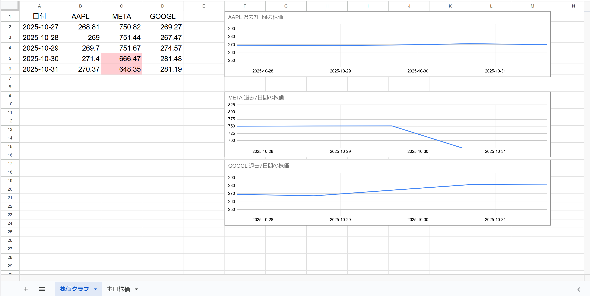

## 📈 株価管理ツール（Google スプレッドシート × Apps Script）

### Google Apps Script と Google スプレッドシートを活用し、
### 米国株（AAPL / META / GOOGL）の株価を自動取得・自動可視化するツールです。

ユーザーが操作しなくても、

### 30分おきのリアルタイム株価取得

### 変動率に応じた自動色分け

### 当日の株価推移グラフの自動更新

### 過去7日間の週次グラフの自動生成

これらがすべて自動で行われます。

日々の株価管理を効率化したい個人投資家や、
スプレッドシートで資産管理を行いたいユーザーに最適です。

---

## 🧭 システム概要

StockSheetSync は、Google Apps Script のトリガーを利用して
リアルタイム（30分おき）＋日次（1日1回） の2段構成で動作します。

### fetchDailyStockPrices（30分おき）  
→ AAPL / META / GOOGL の株価を取得し、「本日株価」シートに追記

### createDailyChart（30分おき）  
→ 当日の株価推移グラフを自動更新

### createSummaryCharts（1日1回）  
→ 過去7日間の株価データを集計し、週次グラフを生成

現在、このスプレッドシートで動作を確認できます：

https://docs.google.com/spreadsheets/d/1EK1zL5p-PEuFRml_fOhKIDMu2qOFJ0JgYKYVibOOoa8/edit?gid=793241765#gid=793241765

---

## 🛠 使用技術

### Google Apps Script（GAS）

スプレッドシート操作

トリガー設定

株価取得ロジック

グラフ生成処理

### Google スプレッドシート

株価データの蓄積

グラフの可視化

ユーザー操作のインターフェース

### GOOGLEFINANCE 関数

過去7日間の株価データ取得（週次グラフ用）

### JavaScript（ES5 ベース）

条件分岐

エラー処理

データ整形

### SpreadsheetApp.ChartBuilder API

日次・週次の折れ線グラフを自動生成

---

## 🛠 主な機能
### 米国市場の取引時間（22:00〜5:00）に合わせた自動取得  
30分おきのトリガーと時間判定により、取引時間帯のみ株価を記録。

### AAPL / META / GOOGL の株価を自動取得・蓄積  
主要テック銘柄を例に、リアルタイムで「本日株価」シートへ追記。

### 5%・10%の変動率に応じた自動色分け  
上昇・下落を視覚的に把握しやすいようにセル背景色を自動変更。

### 取得失敗時のエラーハンドリング（グレー表示）  
APIエラーやデータ欠損時でも視認性を保つため、値をグレーで表示。

### 当日の株価推移グラフを自動更新（30分おき）  
createDailyChart() により、リアルタイムで折れ線グラフを更新。

### 過去7日間の株価をまとめた週次グラフを自動生成（1日1回）  
createSummaryCharts() がシートを再構築し、7日分の推移を可視化。

### 日付が変わると「本日株価」シートを自動リセット  
新しい日付に切り替わると、当日分の記録をゼロから開始。

### 全シートに日付・スタイルを統一適用  
フォントサイズ、行高、中央揃えなどを自動設定し、視認性を最適化。

---

## 🧭 システムの流れ

StockSheetSync は、Google Apps Script のトリガーを利用して
リアルタイム（30分おき）＋日次（1日1回） の2段構成で動作します。

### 🔁 使用するトリガー
### 関数名	                タイミング	        役割
### fetchDailyStockPrices	30分おき	                株価の取得・記録（AAPL / META / GOOGL）
### createDailyChart	        30分おき	                当日の株価推移グラフを自動更新
### createSummaryCharts	        1日1回（例：22:00）	過去7日間の株価データを集計し、週次グラフを生成

※ createSummaryCharts は ScriptProperties により、同日に再実行されないよう制御されています。

## 🧭 システムの流れ（完全版）

以下は、StockSheetSync がどのようにデータを取得し、
どのタイミングでグラフを生成するかを示した全体フローです。

### 1. リアルタイム処理（30分おきトリガー）
### ① fetchDailyStockPrices() — 株価の取得と記録

AAPL / META / GOOGL の株価を取得

「本日株価」シートに追記

取得失敗時はグレー表示

5%、10%の変動に応じてセル色分け

米国市場の取引時間（22時〜5時）に合わせて動作

### ② createDailyChart() — 当日の株価推移グラフを更新

「本日株価」シートのデータをもとに当日の折れ線グラフを自動更新

### 2. 日次処理（1日1回トリガー）
### ③ createSummaryCharts() — 過去7日間の週次グラフを生成

「株価グラフ」シートを削除して再生成

GOOGLEFINANCE を使って過去7日分の株価を取得

変動率に応じた色付け

7日間の折れ線グラフを自動生成

実行日は ScriptProperties に保存し、同日に再実行されないよう制御

temp シートを作成 → データ取得 → 削除まで自動処理

### 3. 日付が変わったときの動作

「本日株価」シートは翌日分としてリセット

createSummaryCharts() が新しい週次グラフを生成

30分おきのリアルタイム更新がそのまま継続

---

## ⚙️ 日次処理（30分ごとトリガー）

トリガーを 30分ごとに設定すると、米国市場の取引時間（日本時間 22時〜翌5時）に
以下の処理が自動実行されます。

### 1️⃣ 株価データの取得と記録（fetchDailyStockPrices）

Apple（AAPL）、Meta（META）、Google（GOOGL）の株価を取得

取得時刻とともに「本日株価」シートへ追記

取得失敗時はグレー表示

5%、10%の変動に応じてセルの色分け

👉 これにより、1日の値動きが30分単位で記録されます。
### 2️⃣ 日次グラフの更新（createDailyChart）

「本日株価」シートのデータから、
各銘柄（AAPL / META / GOOGL）の折れ線グラフを更新

30分ごとに最新の状態に反映

👉 1日の値動きを時系列で視覚的に確認できます。

### 3️⃣ 書式調整

時刻列（A列）は「hh:mm」形式に統一

行の高さ・フォントサイズ・中央揃えなどを自動調整し、視認性を向上

💡 処理後、「本日株価」シートでは 1日分の株価推移とグラフ をまとめて確認できます。
（下の「日次グラフ」の項目で詳しく説明しています）

## 📆 週次処理（1日1回実行）

1日1回のトリガー設定により、過去7日間の株価推移を自動で集計し、
週次グラフとして可視化します。

### 1️⃣ 7日間のデータ取得

AAPL / META / GOOGL の 過去7日間の株価データを
GOOGLEFINANCE 関数で取得

一時的に temp シートへ展開し、データを整形

### 2️⃣ グラフ用シートの作成（株価グラフ）

既存の「株価グラフ」シートがある場合は削除して再生成

3銘柄の7日間の株価推移を 折れ線グラフとして描画

変動率（±5%、±10%）に応じてセル背景色を自動調整

日付・フォーマット・スタイルを統一して視認性を向上

### 3️⃣ 一時シートの削除

週次処理が完了すると、temp シートは自動的に削除されます

次回の週次処理時に再生成されます

### 💡 週次処理の結果

「株価グラフ」シートでは、過去7日間の株価推移をひと目で確認できる週次グラフが生成されます。

（下の週次グラフの項目で詳しく説明しています）

## 📄 処理後に残るシート

シート名	内容
本日株価	30分ごとの株価データを時系列で記録。AAPL / META / GOOGL の当日分の値動きが蓄積される。
株価グラフ	createDailyChart による 当日の株価推移グラフ と、createSummaryCharts による 過去7日間の週次グラフ を可視化するシート。
🧩 処理中のみ存在するシート

### シート名	役割
### temp	createSummaryCharts（週次処理）でのみ使用される一時シート。7日分の株価データを GOOGLEFINANCE で取得する際に生成され、処理完了後に自動削除される。

## 🗂 本日株価シート

このツールの基本となるシートです。
30分ごとに取得した株価データが 時系列で下に追加されていき、
1日の値動きを一覧で確認できます。

初回実行時は 1 行のみ

以降、トリガー実行のたびに自動で追記

createDailyChart により、右側に当日の折れ線グラフが自動生成される

当日の株価推移をリアルタイムで追える、最も重要なシートです。

## 📈 日別グラフ（当日株価のリアルタイム可視化）

「本日株価」シートに蓄積されたデータをもとに、
createDailyChart() が30分ごとに当日の折れ線グラフを自動更新します。

取得された株価が時系列で追加される

グラフはリアルタイムで形になっていく

数時間で当日の値動きが視覚的に把握できるようになる

AAPL / META / GOOGL の上昇・下落が折れ線グラフとして描画され、
当日のトレンドをひと目で確認できる仕組みになっています。

## 📊 週次グラフ（データ一覧）

「株価グラフ」シートでは、
AAPL / META / GOOGL の過去 7 日間の株価データが一覧で表示されます。

・GOOGLEFINANCE 関数で取得した 7 日分の終値をまとめて表示

・日ごとの変動率を自動計算

・±5%、±10% の変動に応じてセル背景色を自動調整

・例：Meta の終値が 10%以上下落した場合、該当セルが赤色で強調表示される

これにより、1週間の値動きやトレンドをひと目で把握でき、
投資判断やレポート作成にも活用できます。
⚠️ グラフ表示の注意点

現在のグラフ設定では、
急激な株価変動（大幅な上昇・下落）が発生した場合、
折れ線グラフの一部が表示範囲から外れることがあります。

これはスプレッドシートの自動スケール調整の仕様によるもので、
今後の改善ポイントとして検討中です。

※以下のデータは22時以降に自動で追加されます。この例では、Metaの前日比10%以上の下落によりC6セルが赤色で強調表示されています。
こちらでも、急激な株価変動に対応しきれず、表示が一部切れてしまっています。

ただ、以下のような別の日付のデータでは、全銘柄の株価変動が正常に取得され、セルの強調表示も問題なく反映されています。急激な変動がなかったため、一覧が最後まで途切れずに確認できました。

---

## 🚀 使い方

Google スプレッドシートを作成

Apps Script エディタを開き、本リポジトリのコードを貼り付け

fetchDailyStockPrices() をトリガーに設定（例：15分ごと）

トリガー設定後、次の区切り時間（例：23:00）まで待つと自動で動き出します！

        
### (注意)

初回実行時、Googleから「このアプリは確認されていません」という警告が表示されることがあります。その場合は以下の手順でスクリプトの実行を許可してください：

①「詳細」をクリック

➁「（プロジェクト名）に移動」を選択

③自分のGoogleアカウントを選択

④アクセス権限を確認し、「許可」をクリック　で実行し直せばOK

※これは、GASプロジェクトがGoogleにより公開確認されていないために表示される標準の警告です。

---

## ✨ 設計上の工夫

このツールは、単に株価を取得するだけでなく、
運用の安定性・視認性・拡張性 を重視して設計されています。

### ⏱ 市場時間の制御（22:30〜5:00）

米国市場の開場時間に合わせて処理を最適化。
30分ごとのトリガーでも、取引時間外は無駄な API 呼び出しを行わないよう制御しています。
🎨 視覚的な工夫（±5% / ±10% の色分け）

### 株価の変動率に応じてセル背景色を自動変更
急騰・急落が一目でわかるため、視覚的な判断がしやすくなっています。

### 🛡 エラー耐性（グレー表示）

取得失敗時でも処理が止まらないように設計。
値が取得できなかった場合は グレー表示にして、
異常値をすぐに識別できるようにしています。

### 📊 グラフの見やすさ（横長レイアウト & 余白調整）

日次・週次のグラフは、
横長レイアウト＋余白調整 により、推移が自然に読み取れるよう最適化。
スプレッドシートの自動スケールの癖を考慮した設計です。

### 🔁 データの重複防止

同じ時刻のデータが重複しないように制御し、
時系列データの整合性を維持しています。
（特に30分間隔の運用では重要なポイント）

### 🧩 再利用性の高いコード構造

銘柄追加・期間変更・グラフの拡張などが容易にできるよう、
関数を役割ごとに分離し、ロジックをモジュール化。
運用後のメンテナンス性も高く保っています。

---    

## 📌 注意点

### ・GOOGLEFINANCE 関数は一時的に取得失敗することがあります。  
ネットワーク状況や Google 側のレスポンス遅延により、値が取得できない場合がありますが、
多くの場合は 次回の実行で自動的に回復します。

### ・トリガー設定後、すぐに処理が走らないことがあります。  
Google Apps Script の仕様上、
トリガーは「設定した瞬間」ではなく 次の実行タイミング から動作します。
30分ごとのトリガーなら、最大で 30 分待つ必要があります。

### ・市場時間外は株価が更新されません。  
米国市場の取引時間（22:00〜5:00）以外は、
fetchDailyStockPrices() が動いても 株価は取得されず、前回値がそのまま表示されます。

### ・スプレッドシートの自動計算タイミングにより、表示が一時的にずれることがあります。  
特に週次処理（GOOGLEFINANCE）では、データが揃うまで数秒〜数十秒かかる場合があります。

---

## 📂 ファイル構成と役割

### ファイル / シート名	役割
### 本日株価（シート）	当日の株価を30分ごとに記録するメインシート。AAPL / META / GOOGL の時系列データが蓄積される。
### 株価グラフ（シート）	createDailyChart による 当日グラフ と、createSummaryCharts による 過去7日間の週次グラフ をまとめて表示する可視化用シート。
### gs ファイル（Apps Script）	株価取得（fetchDailyStockPrices）、日次グラフ生成（createDailyChart）、週次グラフ生成（createSummaryCharts）など、すべてのロジックを記述。
### トリガー設定	30分間隔の自動実行（リアルタイム更新）と、1日1回の週次処理を制御。米国市場の取引時間（22:00〜5:00）に合わせて動作。
 
---

## 📄 .gs ファイルについての簡潔な書き方例

処理内容ごとに複数の .gs ファイルへ分割し、
役割が明確で拡張しやすい構造 になるよう設計しています。

主な構成は以下のとおりです：

### ・株価の取得・記録  
fetchDailyStockPrices() によるリアルタイム株価の取得と「本日株価」への書き込み

### ・グラフの生成  
createDailyChart()（日次グラフ）
createSummaryCharts()（週次グラフ）

### トリガーの設定と制御  
30分おきのリアルタイム更新と、1日1回の週次処理を管理

### データ整形・色分け処理  
変動率に応じたセル色付け、日付フォーマット、スタイル統一など

※ ファイル名は機能単位で分割しており、
　銘柄追加・期間変更・処理拡張が容易な構造 になっています。

---

## 🧩 今後の改善点

### 📈 グラフ機能の強化

### ・2週間・1ヶ月の期間に対応したグラフ生成機能の追加  
より長期のトレンドを把握できるよう、期間選択の柔軟性を拡張予定。

### ・週次グラフを「1日1回のトリガーのみ」で生成できるよう改善  
現在は temp シートを利用した複数ステップ構成のため、
処理フローを簡素化し、より安定した週次生成を目指す。

### ・±10%以上の急激な変動でグラフが表示範囲から外れる問題の改善  
スケール調整や自動レンジ設定の最適化を検討。

### ・緩やかな変化が見えづらい／急騰・急落でグラフが切れる問題の改善  
変動幅に応じたスケール調整や、複数軸の導入などを検討中。

### 🗂 シート構成の整理
シートの表示順を「本日株価 → 株価グラフ」に統一

利用者が自然な流れでデータ → グラフへ移動できるよう、
UI/UX の観点からシート順を最適化する予定。

## ⏱️ 取得タイミングの調整

株価取得は「市場時間」と「日付切り替え」の影響を強く受けるため、
より正確なデータ記録のために以下の改善を予定しています。

### 🕛 0:00〜0:30 の取得で前日分が上書きされる問題の解消

日付が変わった直後は、
GOOGLEFINANCE が前日の終値を返すタイミングがあるため、
当日データとして誤記録される可能性があります。

→ 日付切り替え直後の取得を制御し、
　当日データが安定するまで記録を遅延させる仕組みを検討中。

### 🕔 取引時間（〜5:00）を過ぎて 2 回分カウントされる問題の修正

市場が閉まった後の 5:00〜5:30 に取得が走ると、
同じ終値が重複して記録されることがあります。

→ 取引終了後は 1回のみ記録して停止するように制御を改善予定。

### 🕘 市場開場前（22:00〜22:29）の取得を制御し、誤データを防ぐ

開場直前は GOOGLEFINANCE が
前日の終値を返すことが多いため、誤データが混入しやすい時間帯です。

→ 22:30（米国市場オープン）までは記録をスキップし、
　初回データを正確に取得できるよう調整予定。

### 📉 22時以降まで待たないと正確な終値が取得できない問題の解消

市場が閉まる直後は、
終値が確定するまで数分〜十数分のラグが発生することがあります。

→ 終値確定までの待機ロジックを導入し、確定値のみを記録する仕組みを検討中。

### ⏱️ 終値取得タイミングに関する課題と改善方針

現在の仕様では、米国市場の終値を正しく取得するために
日本時間の22時以降（米国市場の前日終値が確定するタイミング）まで待つ必要があります。

そのため、

週次グラフ

終値一覧

日次の集計処理

これらを 当日中に更新したい場合でも、22 時まで処理を待機する必要がある という制約があり、
レポート作成や日次報告のタイミングに影響するケースがあります。

### 🔧 今後の改善方針

今後は、以下の観点から 取得タイミングと日付の扱いを再設計し、
より柔軟に「当日中の処理完了」ができるよう改善を検討します。

### 終値確定前のデータを扱うロジックの導入  
→ 終値が確定していない場合でも、暫定値として扱える仕組みを検討

### 日付切り替え直後の誤取得を防ぐ制御の強化  
→ 0:00〜0:30 の誤データ混入を防ぎつつ、処理を前倒しできるようにする

### 市場時間外の取得ロジックの見直し  
→ 終値確定のラグを考慮しつつ、より早いタイミングで週次処理を実行可能にする

### 終値確定の判定方法を改善  
→ GOOGLEFINANCE の更新タイミングに依存しすぎない仕組みを検討

### 💡 目指す姿

当日中に週次グラフが完成する

レポート作成のタイミングに左右されない

終値の確定待ちによる遅延を最小化

市場時間・日付切り替えの影響を受けにくい設計

### 🧑‍💻 ユーザー入力への対応

今後は、ユーザーが任意の米国株ティッカー（AAPL / TSLA / AMZN など）を入力すると、
1日分・1週間分の株価推移グラフを自動生成できる機能を追加予定です。

・入力されたティッカーを自動判定

・当日データ（30分間隔）をリアルタイムで取得

・過去7日間の終値を GOOGLEFINANCE で取得

・日次・週次の折れ線グラフを自動生成

・変動率に応じた色分けにも対応

これにより、固定銘柄（AAPL / META / GOOGL）だけでなく、
ユーザーが自由に選んだ銘柄の分析が可能になります。
---
